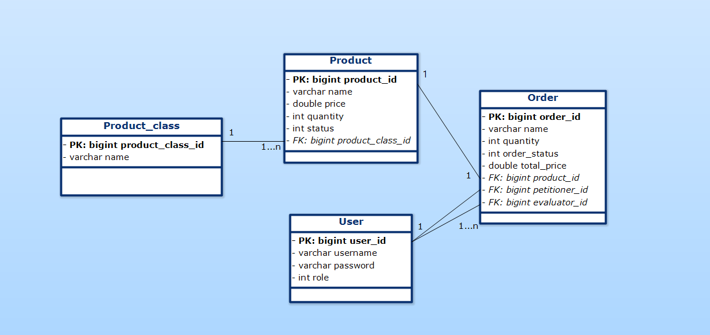

# Raktárkezelő alkalmazás

Egy egyszerű alkalmazás, raktár bevételezés elősegítésére. Lehetőséget nyújt a termékek számontartására, és a dolgozók adatainak rögzítésére.

## Funkcionális követelmények
- Termékek listázása
- Új termék felvétele
- Keresés termékek között

### Raktárosok funkciói
- Termékek számának módosítása (eladás, megérkezett rendelés)
- Rendelési kérelem leadása

### Raktárvezetők funkciói
- Új felhasználók (raktárosok) hozzáadása
- Felhasználók listázása
- Rendelési kérelem elfogadása/elutasítása
- Eladások listázása

### Rendszergazda funkciói
- Szerepkörök kiosztása
- Osztályok létrehozása

## Nem funkcionális elvárások
- Felhasználóbarát, egyszerű, letisztult felület
- Keresési eredmények gyors megjelenítése
- Jelszavas azonosítás, jelszavak biztonságos tárolása

## Szakterületi fogalomjegyzék
- **Rendelési kérelem:** a raktáros jelzi a raktárvezetőnek, hogy fogytán van egy bizonyos termék
- **Osztály:** termékek csoportosítása logikailag, illetve a raktáron belül fizikailag

## Szerepkörök
- **Raktáros:** a termékek nyilvántartásáért felel, tudja módosítani számukat, új termékeket tud felvenni
- **Raktárvezető:** a raktárosokért felel, ő regisztrálja az új raktárosokat
- **Rendszergazda:** raktárvezetői jogosultságokat kezeli, új osztályokat tud létrehozni

# UML

# Credentials

- storeman: c3RvcmVtYW46QWxtYWZhMQ==
- storekeeper: c3RvcmVrZWVwZXI6QWxtYWZhMQ==
- admin: YWRtaW46QWxtYWZhMQ==

## [TestEndpoints](testEndpoints/endpoints.md)